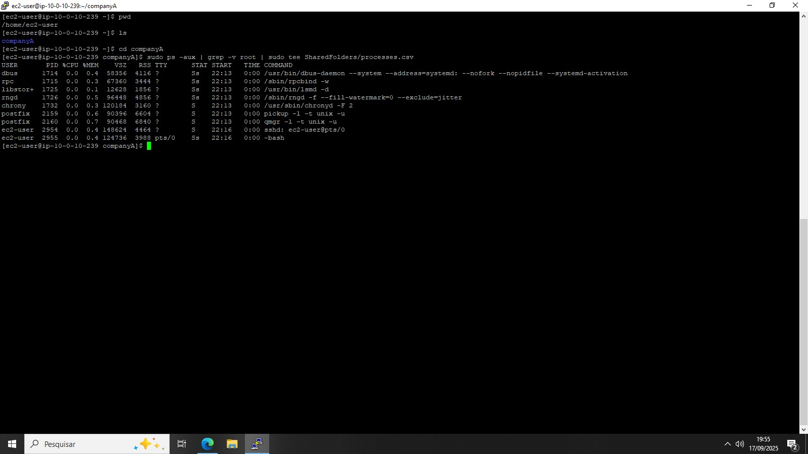
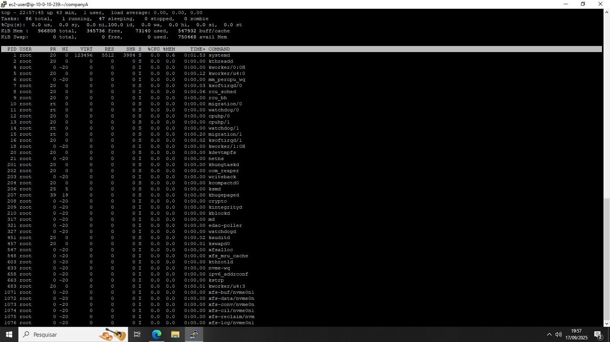
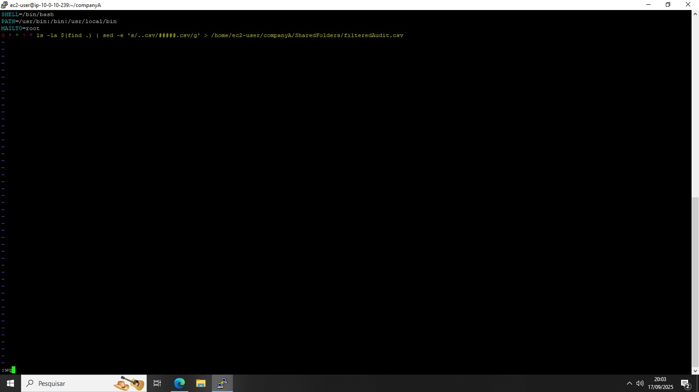
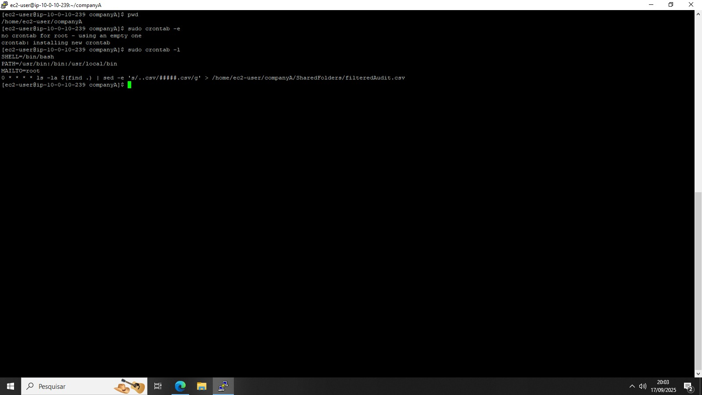

# 🖥️ Laboratório AWS: EC2 + Processos, Monitoramento e Cron Jobs

Este repositório documenta um **laboratório prático** realizado em uma instância **Amazon EC2 (Linux)**.  
Objetivo: listar processos em execução, monitorar o sistema com o comando **top**, e criar um **cron job** para auditar arquivos `.csv`.

---

## 📌 Resumo do que foi feito
- 📝 **Listagem de processos** em execução e exportação para `processes.csv` sem processos do root.  
- 📊 **Monitoramento com `top`** para observar tarefas e uso de CPU/Memória.  
- ⏲️ **Criação de cron job** que gera um arquivo de auditoria (`filteredAudit.csv`) substituindo os nomes de arquivos `.csv` por `#####.csv`.

---

## 🧩 Passo a passo (com imagens)

### 1️⃣ Criar log de processos (Task 2)
- Garanta que está no diretório `/home/ec2-user/companyA`:  
  - `pwd`  
  - Se necessário: `cd companyA`
- Gerar log de processos, omitindo processos do root ou com `[` e `]` no comando:  
  - `sudo ps -aux | grep -v root | sudo tee SharedFolders/processes.csv`
- Validar a criação:  
  - `cat SharedFolders/processes.csv`

> O arquivo `processes.csv` armazena a lista de processos atuais, sem as entradas do root.

---

### 2️⃣ Monitorar processos com top (Task 3)
- Executar:  
  - `top`
- Observar **número de tarefas**, uso de CPU e memória.  
- Para sair, pressione **q**.  
- Ver versão e opções:  
  - `top -hv`

> Exemplo de saída: 93 tarefas totais, 1 em execução, 48 em espera, 0 paradas e 0 em estado zumbi.

---

### 3️⃣ Criar Cron Job para auditoria (Task 4)
- Garanta que está no diretório `/home/ec2-user/companyA`:  
  - `pwd`
- Editar crontab como root:  
  - `sudo crontab -e`
- No editor, inserir as linhas:  
  - `SHELL=/bin/bash`  
  - `PATH=/usr/bin:/bin:/usr/local/bin`  
  - `MAILTO=root`  
  - `0 * * * * ls -la $(find .) | sed -e 's/..csv/#####.csv/g' > /home/ec2-user/companyA/SharedFolders/filteredAudit.csv`
- Salvar e sair: **ESC → :wq → ENTER**
- Validar cron job:  
  - `sudo crontab -l`

  

> O cron job executa a cada hora, gerando `filteredAudit.csv` com os nomes de todos os arquivos `.csv` mascarados.

---

## 🛠️ Comandos principais
- `pwd`  
- `cd companyA`  
- `sudo ps -aux | grep -v root | sudo tee SharedFolders/processes.csv`  
- `cat SharedFolders/processes.csv`  
- `top`  
- `top -hv`  
- `sudo crontab -e`  
- `sudo crontab -l`

---

## ✅ Observações finais
Este laboratório demonstra:
- Como **filtrar e registrar processos** em execução.  
- Monitorar **desempenho em tempo real** com `top`.  
- Criar e validar **tarefas agendadas com cron** para auditoria de arquivos.

Todos os arquivos e saídas foram salvos e validados dentro da pasta **SharedFolders**.
